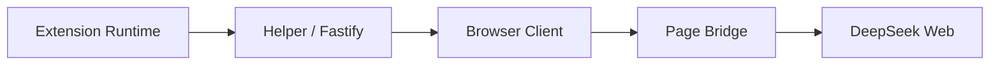

# Slidev Presentation Implementation Plan

> **For agentic workers:** REQUIRED SUB-SKILL: Use superpowers:subagent-driven-development (recommended) or superpowers:executing-plans to implement this plan task-by-task. Steps use checkbox (`- [ ]`) syntax for tracking.

**Goal:** Add an isolated Slidev presentation for the DeepSeek Web Bridge sharing deck while preserving the existing markdown briefing document.

**Architecture:** Keep the current share document as source material in `docs/`, then add a separate Slidev entry file under `slides/` plus dedicated npm scripts and an isolated `slides-dist` output directory. Verification comes from a real Slidev build rather than repo tests, because this task is presentation/configuration work rather than application behavior.

**Tech Stack:** Node.js, npm, Slidev, Markdown, Mermaid

---

### Task 1: Add Slidev toolchain wiring

**Files:**
- Modify: `package.json`
- Modify: `package-lock.json`
- Modify: `.gitignore`

- [ ] **Step 1: Update npm scripts and devDependencies in `package.json`**

Add a `@slidev/cli` dev dependency and these scripts:

```json
{
  "scripts": {
    "slides:dev": "slidev slides/web-providers.md",
    "slides:build": "slidev build slides/web-providers.md --out slides-dist",
    "slides:export": "slidev export slides/web-providers.md"
  },
  "devDependencies": {
    "@slidev/cli": "<resolved version>"
  }
}
```

- [ ] **Step 2: Keep generated Slidev build output out of git**

Append this ignore entry:

```gitignore
slides-dist/
```

- [ ] **Step 3: Install dependencies and refresh `package-lock.json`**

Run: `npm install`

Expected: `package-lock.json` updates with `@slidev/cli` and its dependency tree.

---

### Task 2: Author the Slidev deck

**Files:**
- Create: `slides/web-providers.md`
- Reference: `docs/2026-04-09-deepseek-web-bridge-sharing.md`

- [ ] **Step 1: Create Slidev frontmatter and theme defaults**

Start the deck with:

```md
---
theme: default
title: DeepSeek Web Bridge
info: DeepSeek Web Bridge 项目分享
class: text-left
drawings:
  persist: false
transition: slide-left
mdc: true
---
```

- [ ] **Step 2: Convert the existing 12-page outline into Slidev slides**

Create one slide per section, separated by `---`, covering:

```md
# DeepSeek Web Bridge
## 把网页能力转成可调用 Provider
```

and later slides for architecture, request flow, key implementation points, API differences, defects, and summary.

- [ ] **Step 3: Use Mermaid for the architecture and sequence visuals**

Include at least:

```md

```

and a sequence diagram for the request path.

- [ ] **Step 4: Keep slide copy presentation-ready**

Use short bullets on slides and move longer explanations into speaker-note style text blocks only when needed. The defects slide must include:

```md
- 不能恢复真实历史对话
- 目前只支持文字对话
- 单请求串行，并发能力弱
- 强依赖页面结构和页面协议
- 恢复和调试能力有限
```

---

### Task 3: Verify the Slidev deck end-to-end

**Files:**
- Verify: `slides/web-providers.md`
- Verify: generated output in `slides-dist/`

- [ ] **Step 1: Run the Slidev production build**

Run: `npm run slides:build`

Expected: exit code `0` and generated output under `slides-dist/`.

- [ ] **Step 2: Inspect the generated deck entry**

Run: `rg --files slides-dist | head`

Expected: built HTML/assets are present.

- [ ] **Step 3: Review git diff for scope**

Run: `git status --short`

Expected: only Slidev-related files plus the pre-existing unrelated repo changes.

---

### Task 4: Document usage for the user

**Files:**
- Reference: `package.json`
- Reference: `slides/web-providers.md`

- [ ] **Step 1: Report exact commands**

Document these commands in the handoff:

```bash
npm run slides:dev
npm run slides:build
npm run slides:export
```

- [ ] **Step 2: Call out verification evidence**

Summarize the `slides:build` result, whether `slides-dist/` was generated, and any gaps if export was not run.
