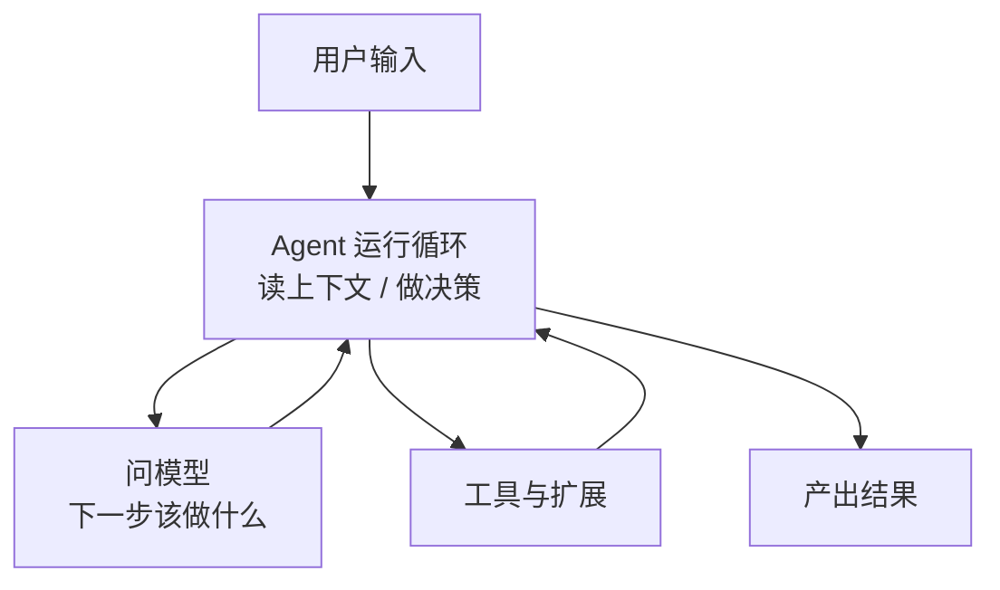

  

    

      <GithubIcon class="w-3 h-3 mr-1" /> · github.com/dive2Pro/web-providers
    

    <h1 class="mt-6 text-5xl font-black leading-tight tracking-tight">
      web-providers
    </h1>
    

      把网页端模型能力接入 code agent
    

  

---
layout: two-cols
---

# Code Agent 是什么

- 可以把它理解成一个会自己干活的终端助手
- 你给它目标，它不会只回一句话，而是会继续拆步骤
- 它会决定读文件、跑命令、调工具，还是继续问模型
- 它真正有用的地方，不是会聊，而是会一轮一轮往下执行

::right::

  
拆开看，主要就是这几层

  

    
接用户输入

    
决定下一步干什么

    
调模型和工具

    
调工具再回来继续

  

---
layout: full
---

# Code Agent 是怎么跑的

  
先拿到目标和上下文

  
再循环判断下一步是调工具，还是继续问模型

  
直到把事做完，再把结果返回给用户

---
layout: two-cols
---

# Pi Code Agent 是什么

- 它是一个可以自己掌控 agent 对话流程的 code agent 运行时
- 不是只能把 prompt 丢进去等返回，而是能控制每一轮怎么继续
- 什么时候继续问模型，什么时候调工具，什么时候结束，都能自己定义
- 这也是我们选择它的原因: 对流程控制权足够大

::right::

  
能控制每一轮对话怎么往下走

  
能决定工具调用和模型调用怎么穿插

  
能把会话、状态和上下文握在自己手里

  
所以很适合接非标准的模型来源

---
layout: two-cols
---

# Provider 是什么

- 可以把它理解成模型接入层的统一插槽
- 上层只管发消息、拿结果，不关心底层接的是 API 还是网页
- provider 负责把请求翻译出去，再把结果翻译回来
- 只要 provider 接口不变，上层 agent 就能继续跑

::right::

  
统一模型列表和调用入口

  
统一消息格式和参数

  
统一返回结构和事件流

  
上层不用感知底层实现差异

---
layout: two-cols
---

## 能不能开个脑洞

- 既然网页上已经能直接对话，那能不能别只让人手动用
- 能不能把这份能力接进 code agent，让它也能调起来
- 如果要接进去，对上层来说最好还是一个标准 provider
- 这样 agent 根本不用知道背后其实是网页

::right::

  

    这里真正的问题是：
  

  

    能不能把网页端对话，
     
    伪装成一个 provider？
  

  

    如果可以，上层还是按 provider 去调，
     
    只是底层从官方 API 变成了网页会话。
  

---
layout: center
class: text-center
---

  

    Demo Time
  

  <h1 class="mt-6 text-6xl font-black tracking-tight text-slate-900">
    Demo Time
  </h1>
  

    下面看它是怎么真的跑起来的
  

---
layout: two-cols
---

# 当前 Provider 在做什么

- 把 code agent 送下来的上下文整理成模型能吃的输入
- 告诉运行时这里有哪些模型、怎么调用
- 把返回结果整理回 code agent 能认识的结构
- 让上层继续按同一种方式消费结果

::right::

  
整理消息和上下文

  
补上初始化信息和调用参数

  
把请求交给 helper / browser worker

  
把结果转回 text / tool / thinking

---
layout: full
---

  <h1>一次调用如何从 Code Agent 走到 Provider</h1>
  

    

      
1

      
Code Agent

      
发起 `streamSimple(model, context)`

    

    

      
2

      
Local Provider

      
整理消息、拼 session 初始化参数

    

    

      
3

      
Helper

      
接收 `/v1/provider/chat`，转成统一请求

    

    

      
4

      
Browser Worker

      
把 prompt 发到网页会话，等待分片结果

    

    

      
5

      
返回 Code Agent

      
结果被整理回 provider 响应，再转成 assistant 事件

    

  

  

    

      Code Agent
      →
      Local Provider
      →
      Helper
      →
      Browser Worker
      →
      网页会话
      →
      返回 Code Agent
    

  

---
layout: two-cols
---

# 这和真实 API 调用有什么不同

- 官方 API 是直接调模型服务
- 现在这套不是直连服务，而是把网页对话能力接进来
- 所以难点不在发请求，而在网页状态、结果转译和异常恢复

::right::

  

    
官方 API

    <ul class="mt-3 leading-7">
      <li>程序直接请求模型服务</li>
      <li>协议稳定，输入输出都比较标准</li>
      <li>返回结果本来就是给程序消费的</li>
    </ul>
  

  

    
当前方案

    <ul class="mt-3 leading-7">
      <li>程序先去驱动网页会话</li>
      <li>再把网页结果整理成 provider 响应</li>
      <li>本质是在把网页能力包装成 API 能力</li>
    </ul>
  

---
layout: two-cols
---

# 这个工具的价值

::right::

  
适合编码任务，也适合翻译、新闻抓取、信息整理

  
网页端对话能力可以被 CLI 和 agent 直接调用

  
把“人在网页里用”变成“程序里能调”

  
还能把不同网页来源的能力聚合到一条链路里

::left::

  

    白嫖
  

  

    最新网页端模型能力，
     
    被收进 CLI 和 agent 工作流里。
  

---
layout: two-cols
---

# 当前项目缺陷与边界

- 不能恢复真实历史对话
- 目前只支持文字对话
- 单请求串行，并发能力弱
- 强依赖页面结构和页面协议
- 恢复和调试能力有限

::right::

  
会话恢复能力不足

  
多模态输入链路未打通

  
MODEL_BUSY 单请求约束

  
页面改版风险高

  
恢复和 debug 还偏初级

---
layout: end
---

# 总结

  

    
Pi

    
定义统一抽象与交互语义

  

  

    
Provider

    
把能力接进运行时

  

  

    
价值

    
把网页能力收进 CLI 和 agent

  

 